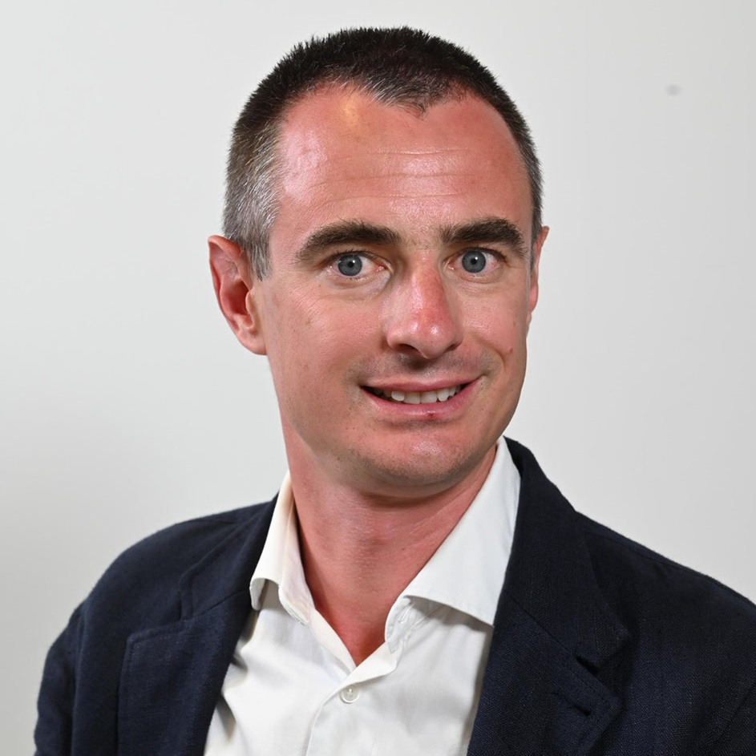

  

    
  

  

    <h1>Pietro Ferrara</h1>
    
Associate Professor in Computer Science Ca' Foscari University of Venice

    

      My research focuses on the application of abstract interpretation-based static analysis
      to the security and reliability of software systems, and on modern software architectures
      (e.g., microservices). I am part of the
      <a href="https://unive-ssv.github.io/">Software and System Verification group</a>.
    

    

      <a class="btn" href="research.html">Research</a>
      <a class="btn" href="publications.html">Publications</a>
      <a class="btn" href="students.html">For Students</a>
      <a class="btn btn-outline" href="cv.pdf">Curriculum Vitae</a>
    

  

  

    <h3>Research</h3>
    
Static analysis by abstract interpretation applied to microservices, robotic systems, blockchain software, and modern software architectures.

    <a class="more" href="research.html">Current projects »</a>
  

  

    <h3>For Students</h3>
    
Interested in a thesis, an internship, a PhD, or a collaboration? Here is how to get in touch and work with me.

    <a class="more" href="students.html">How to collaborate »</a>
  

  

    <h3>Publications</h3>
    
Journal articles, conference and workshop papers on static analysis, program verification, and software security.

    <a class="more" href="publications.html">Full list »</a>
  

## Highlights

<ul class="highlights">
  <li>2026 3rd place in the Java track of <a href="https://sv-comp.sosy-lab.org/">SV-COMP 2026</a> with JLiSA, the Java frontend of LiSA</li>
  <li>2026 Papers accepted at <a href="publications.html">SAS 2026, ECSA 2026, and TACAS 2026</a></li>
  <li>Oct. 2025 Organizer of Dagstuhl Seminar 25421 “Sound Static Program Analysis in Modern Software Engineering”</li>
  <li>Mar. 2025 National habilitation (ASN) for full professorship in the ING-INF/05 scientific area</li>
  <li>Feb. 2025 Invited Professor at Sorbonne Université, Computer Science Laboratory</li>
  <li>Oct. 2024 Finalist for the Best Safety, Security, and Rescue Robotics paper award at IROS 2024</li>
</ul>
